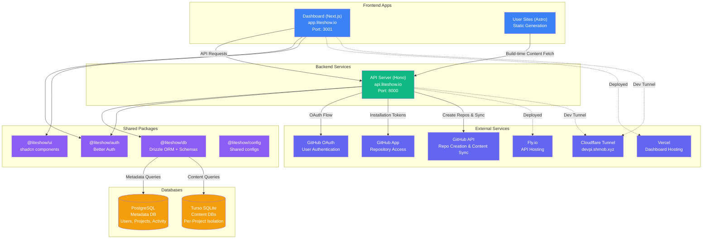
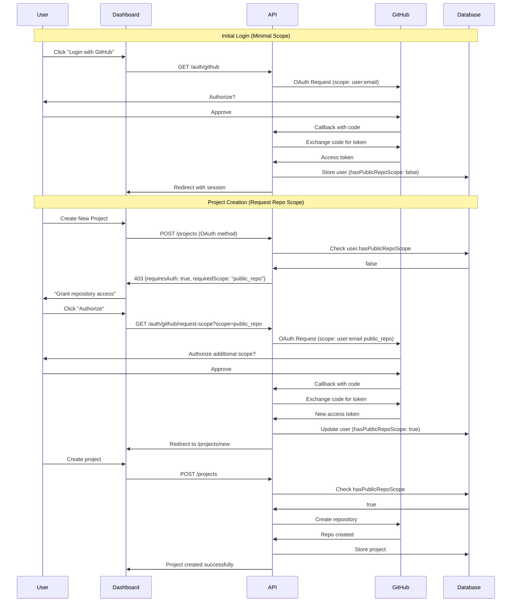
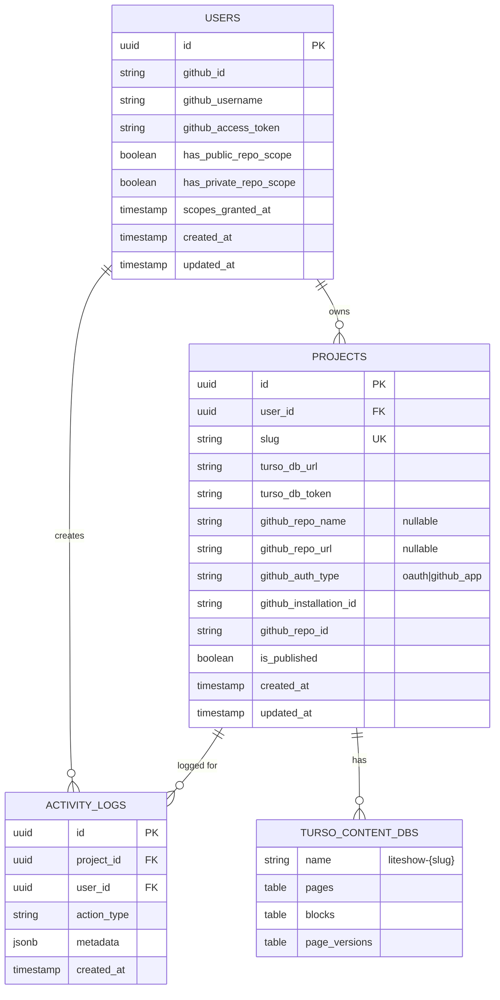
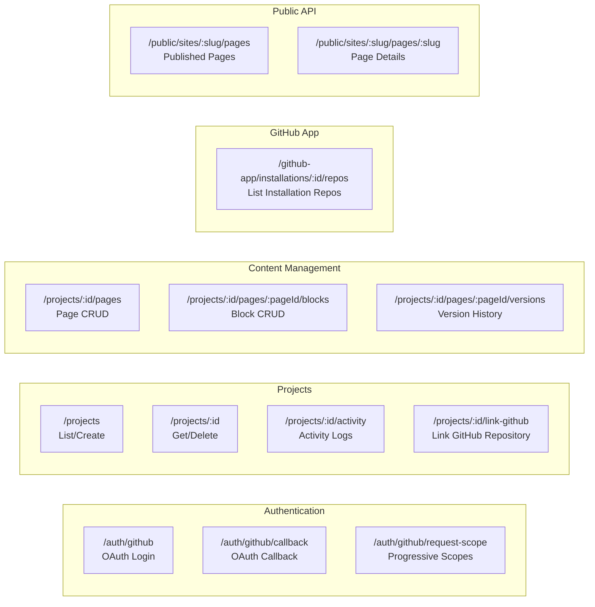
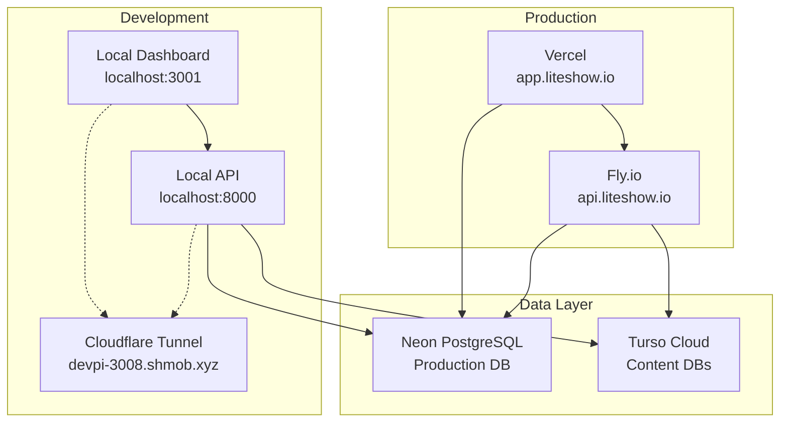

# Liteshow Architecture

Living architecture documentation for the Liteshow monorepo. This diagram is updated as features are implemented.

**Last Updated**: 2025-12-31 - GitHub App Integration Complete

## System Overview



## Progressive GitHub Permissions Flow



## Database Schema



## API Routes Structure



## Monorepo Structure

```
liteshow/
├── apps/
│   ├── api/                    # Hono backend (Fly.io)
│   │   ├── src/
│   │   │   ├── routes/         # API endpoints
│   │   │   ├── lib/            # GitHub App, git-sync
│   │   │   ├── middleware/     # Error handling
│   │   │   └── __tests__/      # Vitest integration tests ✨ NEW
│   │   └── vitest.config.ts    # ✨ NEW
│   │
│   ├── dashboard/              # Next.js admin (Vercel)
│   │   ├── src/app/            # App Router
│   │   └── components/         # React components
│   │
│   └── sites/                  # Astro template (future)
│
├── packages/
│   ├── db/                     # Database layer
│   │   ├── src/
│   │   │   ├── schema.ts       # PostgreSQL schema ✨ UPDATED
│   │   │   ├── content-schema.ts
│   │   │   └── index.ts
│   │   └── migrations/         # SQL migrations ✨ NEW
│   │
│   ├── auth/                   # Better Auth setup
│   ├── ui/                     # Shared UI components
│   └── config/                 # Shared configs
│
└── docs/                       # Documentation
    └── ARCHITECTURE.md         # ✨ NEW - This file!
```

## Authentication Methods

### OAuth Method (Simple)
- **User Journey**: Liteshow creates repo for user
- **Scopes**:
  - Initial: `user:email`
  - On-demand: `public_repo` or `repo`
- **Best For**: Users who want quick setup
- **Implementation**: Standard GitHub OAuth flow

### GitHub App Method (Advanced)
- **User Journey**: User installs app, selects repos
- **Access**: Installation tokens (1-hour validity)
- **Best For**: Organizations, existing repositories
- **Implementation**: JWT generation + installation tokens

## Deployment Architecture



**Current Deployment Status:**
- ✅ **API**: Deployed to Fly.io at `api.liteshow.io`
- ✅ **Dashboard**: Deployed to Vercel at `liteshow-dashboard.vercel.app`
- ✅ **Development**: Active Cloudflare Tunnel at `devpi-*.shmob.xyz`

## Key Features Implemented

### ✅ Phase 1: Core Infrastructure
- Monorepo setup with Turborepo
- PostgreSQL metadata database
- Turso per-project content databases
- GitHub OAuth authentication

### ✅ Phase 2: Content Management
- Page and block CRUD operations
- Version history and rollback
- Git sync to GitHub repositories
- Activity logging

### ✅ Phase 3: GitHub App Integration (Complete)
- ✅ Minimal initial OAuth scope (`user:email`)
- ✅ Progressive scope requests (`public_repo`, `repo`)
- ✅ GitHub App integration (JWT, installation tokens)
- ✅ Unified token helper (OAuth vs App)
- ✅ Database schema for permission tracking
- ✅ Backend API routes
- ✅ Integration tests (23 passing)
- ✅ Frontend GitHub setup wizard (OAuth vs GitHub App choice)
- ✅ Repository selection UI for GitHub App
- ✅ GitHub App callback and installation flow
- ✅ Environment-based GitHub App configuration

### 📋 Phase 4: Deployment Monitoring (Next)
- Repository webhook setup
- Netlify/Vercel deployment triggers
- Build status tracking

### 📋 Phase 5: AI Content Assistant
- Claude integration for content generation
- SEO optimization suggestions

### 📋 Phase 6: Production Readiness
- Custom domains
- Analytics
- Error monitoring

---

**Note**: This architecture diagram should be updated whenever significant changes are made to the system structure, data flows, or integrations.
